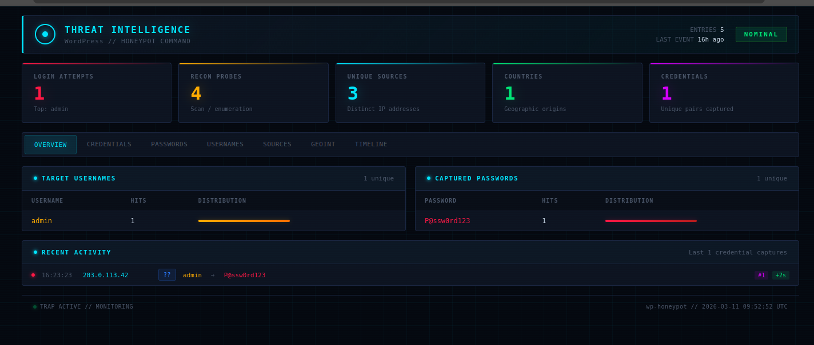

# wp-honeypot

A WordPress login honeypot and tarpit. Serves a pixel-perfect fake `/wp-login.php` page that logs attacker credentials, applies progressive delays, and feeds fail2ban for long-duration IP bans.

Your real login lives at a hidden URL (via [WPS Hide Login](https://wordpress.org/plugins/wps-hide-login/) or similar). Attackers hitting the default WordPress login paths get trapped.



## How it works

1. Apache rewrite rules redirect unauthenticated requests to `/wp-login.php` and `/wp-admin` to `wp-trap.php`
2. The fake login page looks identical to a real WordPress login (same CSS, same error messages, same headers)
3. Each login attempt is logged to two files:
   - Simple log for fail2ban: `[timestamp] HONEYPOT: IP - attempt N - user=X`
   - Full JSONL intelligence: credentials, headers, user agent, Cloudflare country, timing
4. Progressive tarpit delays: 2s, 4s, 6s... up to 30s per attempt (configurable)
5. After 20 attempts (configurable), fail2ban bans the IP for 30 days via iptables

Logged-in administrators with valid WordPress cookies bypass the honeypot entirely.

## Quick start

```bash
# 1. Clone the repo
git clone <repo-url> wp-honeypot && cd wp-honeypot

# 2. Configure for your site
cp config.env.example config.env
# Edit config.env with your site name, URL, and target info

# 3. Deploy
./install.sh
```

## Install modes

```bash
# Local (running on the WordPress server itself)
./install.sh --local /var/www/html

# Remote via SSH
./install.sh --ssh root@webserver /var/www/html

# Proxmox LXC container
./install.sh --pct root@proxmox-node 550 /var/www/html

# Auto-detect from config.env
./install.sh
```

## Configuration

Copy `config.env.example` to `config.env`:

| Variable | Default | Description |
|----------|---------|-------------|
| `SITE_NAME` | `My WordPress Site` | Shown on fake login page |
| `SITE_URL` | `https://example.com` | Used in fake WP headers |
| `LOG_FILE` | `/var/log/wp-honeypot.log` | fail2ban watches this |
| `INTEL_FILE` | `/var/log/wp-honeypot-intel.jsonl` | Full intelligence log |
| `STATE_DIR` | `/tmp/wp-honeypot` | Per-IP state tracking |
| `MAX_DELAY` | `30` | Maximum tarpit delay (seconds) |
| `F2B_MAXRETRY` | `20` | Attempts before ban |
| `F2B_FINDTIME` | `86400` | Detection window (seconds) |
| `F2B_BANTIME` | `2592000` | Ban duration (30 days) |

## Intelligence viewer

```bash
./tools/honeypot-intel.sh summary     # Overview: top usernames, passwords, IPs
./tools/honeypot-intel.sh live        # Real-time feed
./tools/honeypot-intel.sh creds       # All username:password pairs
./tools/honeypot-intel.sh passwords   # Password frequency ranking
./tools/honeypot-intel.sh usernames   # Username frequency ranking
./tools/honeypot-intel.sh countries   # Attacks by country (Cloudflare)
./tools/honeypot-intel.sh timeline    # Hourly attack histogram
./tools/honeypot-intel.sh ip 1.2.3.4  # Drill down on specific IP
./tools/honeypot-intel.sh banned      # Currently banned IPs
```

## What gets logged

Every POST (login attempt) records:

```json
{
  "timestamp": "2026-03-10T14:22:33+00:00",
  "ip": "203.0.113.45",
  "attempt": 5,
  "username": "admin",
  "password": "password123",
  "remember_me": false,
  "redirect_to": "/wp-admin/",
  "headers": {
    "user_agent": "Mozilla/5.0 ...",
    "cf_ipcountry": "CN",
    "cf_ray": "abc123"
  },
  "delay_applied": 10,
  "country": "CN"
}
```

GET requests (reconnaissance) are also logged with URI, headers, and country.

## Requirements

- PHP 5.4+
- Apache 2.4+ with `mod_rewrite`
- fail2ban
- iptables (for banning)
- Python 3 (for the intel viewer)
- Cloudflare (optional, for country-level geo data)

## File layout

```
wp-honeypot/
├── install.sh                  # Deployment script
├── config.env.example          # Configuration template
├── trap/
│   ├── wp-trap.php             # Honeypot script (goes in WP root)
│   └── wp-trap-config.php      # Config template (goes in WP root)
├── fail2ban/
│   ├── filter.d/wp-honeypot.conf
│   ├── jail.d/wp-honeypot.conf
│   └── jail.local
├── apache/
│   ├── honeypot-rewrite.conf   # Rewrite rules for .htaccess
│   └── security-headers.conf   # Bonus security headers
└── tools/
    └── honeypot-intel.sh       # Intelligence viewer
```

## Math

With default settings (maxretry=20, delay=2s per attempt increment):

- Attempts 1-20: 2+4+6+8+10+12+14+16+18+20+22+24+26+28+30+30+30+30+30+30 = **~7 minutes of tarpit**
- Then: **30-day iptables ban**

## License

MIT
